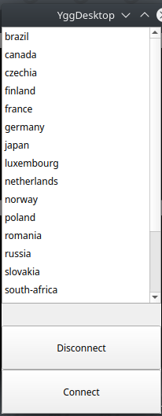

# YggDesktop

YggDesktop is a [gambas](gambas.sourceforge.net) based desktop application that enables easy access to [yggdrasil](yggdrasil-network.github.io/)

## How to run

I'm not sure how to package it yet, but my development flow is

- Clone the repo `git clone https://github.com/xmonader/YggDesktop`
- Using gambas IDE click on `make executable`
- with privileged access as root do `./YggDesktop.gambas`

## How it works

### Ygg module
- Allows fetching peers information
- Generating config
- Running Yggdrasil with the generated config file
